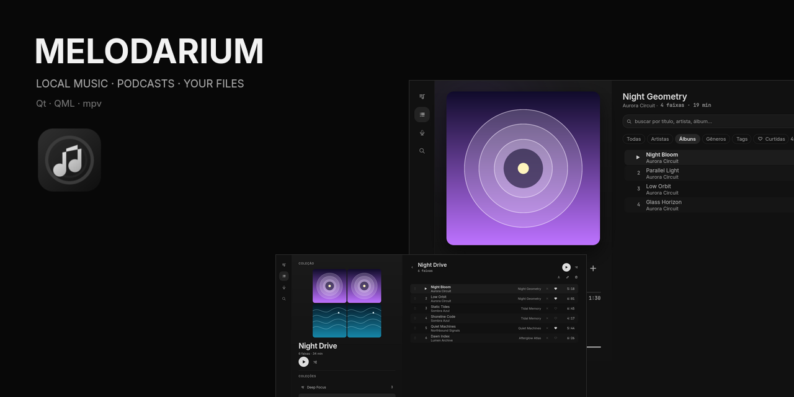
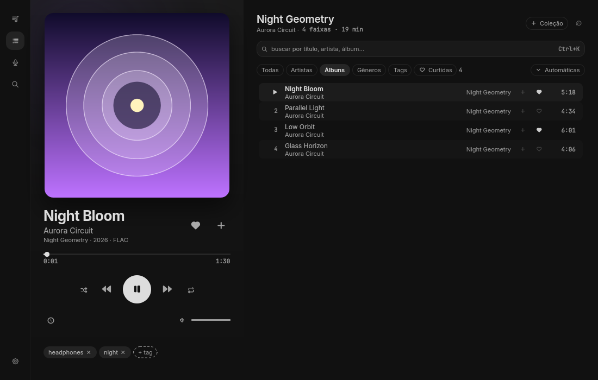
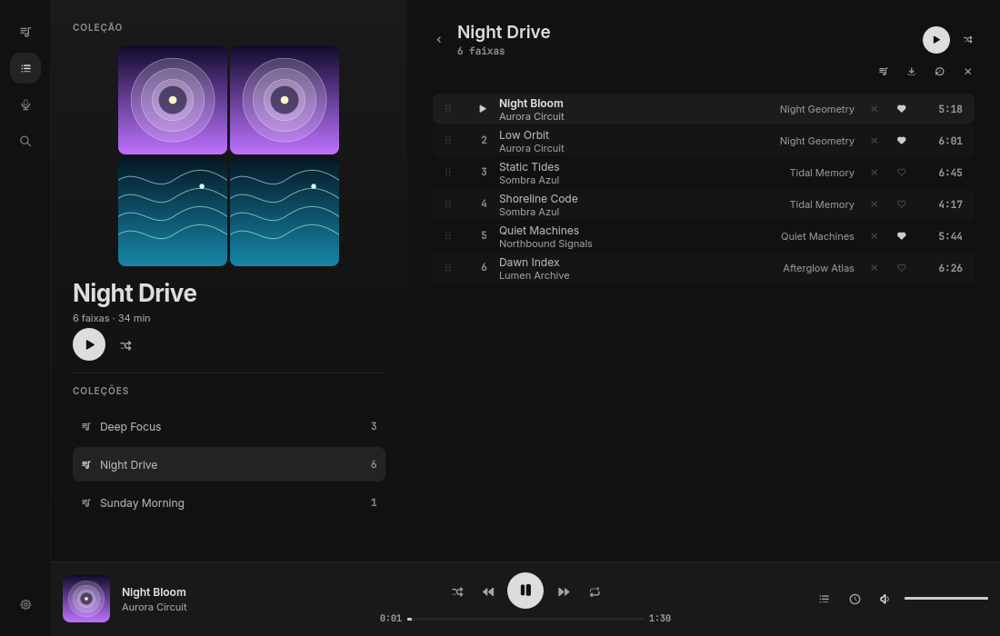
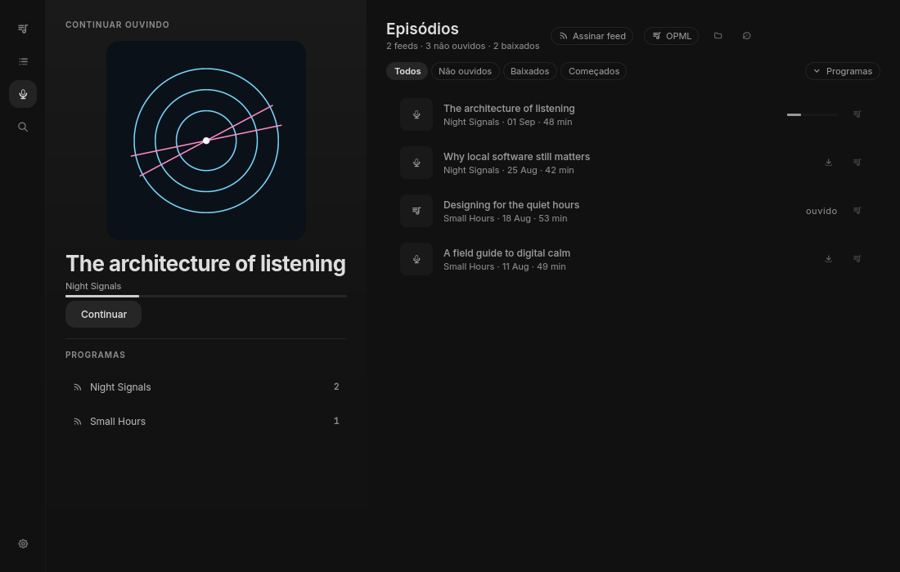
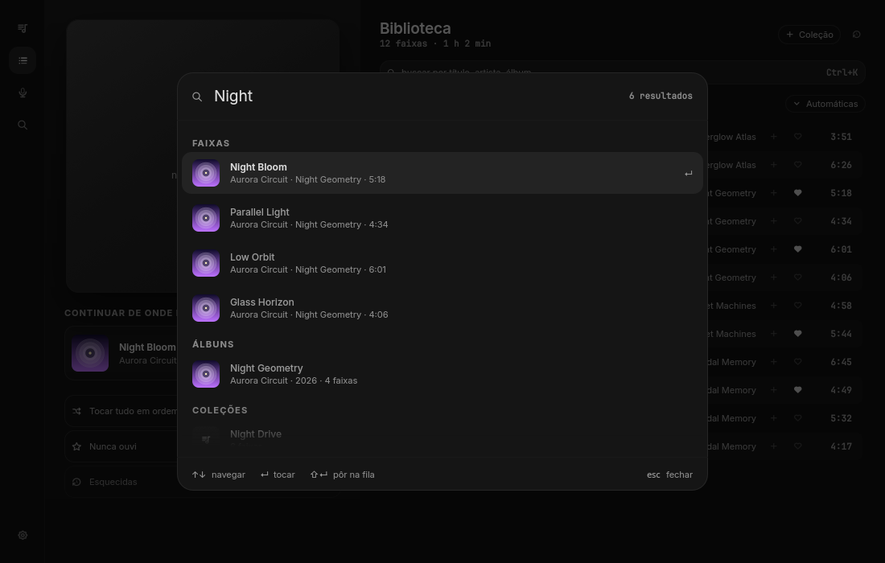

<div align="center">
  

  <h1>Melodarium</h1>

  <p><strong>English</strong> · <a href="README.pt-BR.md">Português (Brasil)</a></p>

  <p>
    
    
    <a href="LICENSE"></a>
    
  </p>

  <p><strong>A privacy-first, local-first music and podcast player for Linux.</strong><br>
  Browse your own library, follow RSS podcasts and play everything through libmpv.</p>

  <p><a href="https://github.com/pedronalis/melodarium/releases/latest"><strong>Latest release</strong></a> · <a href="#see-it-running">Screenshots</a> · <a href="#quick-start-on-fedora">Build from source</a> · <a href="#flatpak">Flatpak</a></p>
</div>

> [!IMPORTANT]
> Melodarium is an early Linux preview, developed and verified on Fedora 43 with Wayland/Hyprland.
> The project is free software released under `GPL-3.0-only`; expect breaking changes while the
> first stable release is still taking shape.

## Melodarium at a glance

| | |
|---|---|
| Best for | Personal local music libraries and RSS podcasts |
| Platform | Linux; Fedora 43 with Wayland is the reference environment, with X11 fallback |
| Audio | libmpv playback without an application-forced sample rate or sample format |
| Storage | Local SQLite catalog; no account, cloud library or telemetry |
| Stack | Qt 6, QML, C++20, libmpv and TagLib |
| Distribution | Source build and an x86_64 Flatpak preview bundle |
| License | Free and open-source software under `GPL-3.0-only` |

## Why Melodarium: a library, not a feed

Melodarium is for people who still keep music files, care about album context and want podcasts
without turning their listening history into somebody else's dataset. It scans local folders,
keeps its catalog in SQLite and hands playback to libmpv. There is no account, cloud library or
telemetry.

### Key features

- Browse every track or move through artists, albums, genres, tags and smart views.
- Play lossless files without forcing a sample rate or sample format.
- Build ordered collections, edit the live queue and resume the previous music session.
- Subscribe to RSS podcasts, download episodes and resume them independently from music.
- Search tracks, albums, artists, collections, shows and episodes from one keyboard-first overlay.
- Follow the desktop through MPRIS, media keys and the Noctalia color scheme when available.
- Back up and restore the catalog through a versioned, hash-checked bundle.

## See it running

| Now playing | Collections |
|:--:|:--:|
|  |  |

| Podcasts | Search |
|:--:|:--:|
|  |  |

These are not design mockups. Every image was saved by the current QML application using a
disposable catalog, generated FLAC audio and original synthetic artwork.

## Quick start on Fedora

Melodarium currently targets Linux. Fedora 43 is the reference environment; other distributions
may work when they provide Qt 6.5+, libmpv and TagLib development packages.

```bash
sudo dnf install cmake ninja-build gcc-c++ \
  qt6-qtbase-devel qt6-qtdeclarative-devel \
  mpv-devel taglib-devel \
  rsms-inter-fonts jetbrains-mono-fonts

git clone https://github.com/pedronalis/melodarium.git
cd melodarium
cmake -S . -B build -G Ninja
cmake --build build
./build/melodarium
```

Install it for the current user with:

```bash
cmake --install build --prefix "$HOME/.local"
```

This installs the executable, desktop entry, AppStream metadata and Freedesktop icon.

## Flatpak

Tagged releases publish an x86_64 Flatpak bundle, SHA-256 checksum and GitHub provenance
attestation on the [Releases page](https://github.com/pedronalis/melodarium/releases). Download the
bundle and checksum into the same directory, then run:

```bash
sha256sum -c melodarium-v0.1.0-x86_64.flatpak.sha256
flatpak install --user ./melodarium-v0.1.0-x86_64.flatpak
```

The repository also includes a pinned Flatpak manifest based on KDE/Qt 6.9 for local builds:

```bash
flatpak install --user flathub org.kde.Sdk//6.9
flatpak-builder --user --force-clean /tmp/melodarium-flatpak-build \
  packaging/io.github.pedronalis.melodarium.yml
flatpak-builder --run /tmp/melodarium-flatpak-build \
  packaging/io.github.pedronalis.melodarium.yml melodarium
```

The sandbox receives audio, graphics acceleration, network access for podcast feeds/media,
Wayland with X11 fallback, MPRIS and read-only access to the XDG Music directory. Folders selected
outside it use the persistent document portal permission.

> [!NOTE]
> The Flatpak does not bundle `yt-dlp`. Podcast RSS and direct media URLs work; YouTube downloads
> that depend on an external `yt-dlp` executable are currently unavailable inside the sandbox.

## What is inside

| Area | Implementation |
|---|---|
| Interface | Qt Quick/QML components, responsive from 720×700 upward |
| Playback | libmpv, queue persistence, shuffle/repeat, sleep timer and ReplayGain |
| Library | TagLib scanner, live folder watcher, SQLite catalog and full-text search |
| Artwork | Asynchronous, content-addressed cover cache with embedded and sibling art |
| Podcasts | RSS/Atom parsing, episode downloads, resume state, OPML import/export |
| Desktop | MPRIS service, media keys, `.desktop`, AppStream and Freedesktop icon |
| Portability | M3U export and validated `.melodarium-backup` bundles |

The QML layer owns presentation and interaction. C++ services expose narrow QML singletons for
playback, data, scanning, downloads, artwork and portability. SQLite stays local; libmpv owns the
audio lifecycle; network access is only used by features that inherently need it.

## Audio behavior

Melodarium does not force an output sample rate or sample format. A 24-bit/192 kHz FLAC reaches
libmpv unchanged by the application; the system audio graph may still resample it. Gapless mode
defaults to mpv's `weak` policy, which preserves same-format album transitions without silently
resampling format changes.

Exclusive output and aggressive gapless are explicit preferences because both have system-wide
or signal-path consequences. ReplayGain starts disabled and only acts when the file contains the
relevant tags. YouTube audio is marked as compressed and is never presented as lossless.

## Local data and privacy

Native installs follow the XDG base directories:

- library database, podcasts and downloads: `$XDG_DATA_HOME/melodarium/melodarium/`;
- preferences: `$XDG_CONFIG_HOME/melodarium/melodarium.conf`;
- artwork cache: `$XDG_CACHE_HOME/melodarium/melodarium/covers/`.

Without explicit XDG variables, Qt maps those to `~/.local/share`, `~/.config` and `~/.cache`.
Flatpak data lives below `~/.var/app/io.github.pedronalis.melodarium/`. A first-run migration keeps
data created under the former application name, `melodia`.

Do not copy an open SQLite database by hand. Use **Settings → Backup and restore**; restoration
checks the bundle version, hashes, SQLite integrity and available space before swapping data.

## Current limits

- The interface text is currently pt-BR; repository documentation and community support are
  available in English and Portuguese.
- Linux is the only tested platform. Wayland/Hyprland is primary; X11 is a supported fallback.
- There is no Flathub listing yet. Release bundles carry a checksum and GitHub provenance
  attestation, but are not signed with a long-lived project key.
- YouTube support uses the `yt-dlp` already installed on a native host and never ships it.

## Frequently asked questions

### Is Melodarium a streaming service or Spotify client?

No. Melodarium plays files you control and follows open RSS/Atom podcast feeds. It does not require
an account and does not provide a cloud music catalog.

### Does Melodarium work offline?

Local music and downloaded podcast episodes work offline. Network access is only needed to refresh
feeds, download remote media or use features backed by an external URL.

### Does Melodarium support FLAC and lossless audio?

Yes. Melodarium delegates playback to libmpv and does not force an output sample rate or sample
format. The operating-system audio graph can still resample the signal.

### Where does Melodarium store its data?

The catalog and downloads stay in XDG user directories, or inside the app-specific Flatpak data
directory. The exact paths and safe backup procedure are documented in
[Local data and privacy](#local-data-and-privacy).

## License

Melodarium is free software under the
[GNU General Public License v3.0 only](LICENSE) (`GPL-3.0-only`). By contributing, you agree to
license your contribution under those same terms.

## Credits

- Visual direction inspired by [Noctalia](https://github.com/noctalia-dev/noctalia-shell), while
  remaining fully usable without it.
- Playback by [mpv/libmpv](https://mpv.io/) and metadata through
  [TagLib](https://taglib.org/).
- The bundled Tabler icon font is MIT-licensed; its notice lives in
  [`assets/fonts/tabler-icons-license.txt`](assets/fonts/tabler-icons-license.txt).
- Interface type uses Inter and technical metadata uses JetBrains Mono when installed.

<div align="center"><sub>Built in Brazil for people who still own their listening.</sub></div>
